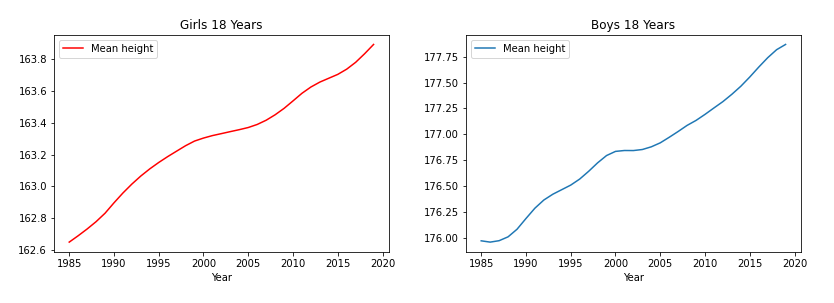
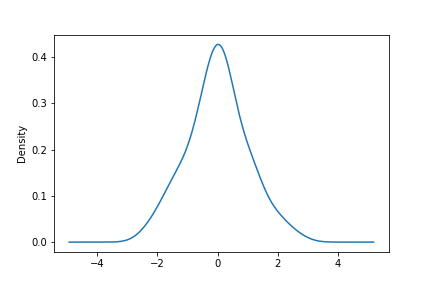
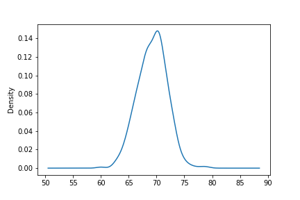

## Statistics 101

# Mean, Median and Mode: What Are they and When Should You Use Them

## You probably remember Mean, Median and Mode from high school stats classes but they are often used badly. We look at how you *should* use them with Python Pandas examples.

---*Splash image here*---

What is the average height of an 18-year-old American male? Or the
average price of a house in Madrid? Or the average grade achieved by
high school students in England?

These are all perfectly worded questions but mean something slightly
different in each case. The average in the first case is calculated
using the *mean*, the house prices would be better represented using the
*median* and the school grades by the *mode*.

We are going to try and unravel which measurement to use and when.

## Averages

The average is a measurement of a central tendency and typically we
would expect that it would be calculated by adding a set of values
together and then dividing by the number of values.

This is the *mean* and this works perfectly well for a normally
distributed set of data like height. The *median* is the central value
meaning that there are an equal number of measurements either side of
this value. Whereas the *mode* is the most frequent value in a set.

### Mean

You can legitimately track the height of 18-year old Americans over time
by adding all of their height together and dividing by the number of
Americans. (That\'s quite a task so you\'d probably want to take a
representative sample instead.)

And if you tracked this over time you\'d get a graph like the one below.

*Public data from [Harvard Dataverse](https://dataverse.harvard.edu/)*

This works fine because height follows a normal distribution.

In a normal distribution values are distributed evenly around a central
point and tail off similarly to the left and right as you can see in the
graph below.

And if we look at the height of a set of individuals we can see that the
measurements follow, pretty much, a normal distribution. Here is the
height data recorded by galton in his famous

...

they are the height measurement of male offspring.

Galton\'s height data, source:Public data from [Harvard
Dataverse](https://dataverse.harvard.edu/)

You can see that the central tendency is around 70 inches and we measure
that by calculating the mean.

### Median

In case of a normal distribution the mean and the median are the same
value but that is not true for other types of distribution.

Take the house price example. In Madrid like in any other major city
there are a wide range of properties and prices but there are a small
number

The data come from the web site [Salary
Sport](https://salarysport.com/football/la-liga/levante/) and to the
best of my knowledge (which is admittedly limited) are, at least
indicative of the actual salaries.

Mean weekly wage with Messi 49051.724137931036

Mean weekly wage without Messi 15089.285714285714

3.250765149969394

<https://gist.github.com/alanjones2/4d570fc1c9835d4732c1d64bbaaca547>

Median weekly wage with Messi 15000.0

Median weekly wage without Messi 14500.0

1.0344827586206897

### Mode

Mode is used for categorical data
